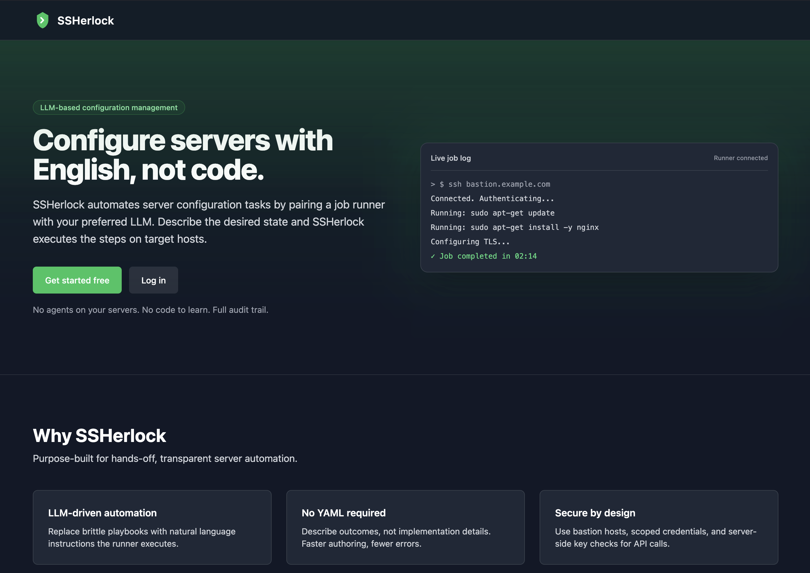

# SSHerlock

An SSH-based autonomous agent to replace system administrators.
Like Ansible, but using an LLM to configure hosts instead of YAML.



## Architecture

SSHerlock is comprised of a Django web app and 1 or more job runners.

- Control flow:
  - User adds credentials, hosts, and other configurations in the web app.
  - User creates a job with a prompt for the LLM to configure the target hosts (e.g. "Install Nginx with SSL").
  - A pending job is created, which is picked up by a runner.
  - The runner interacts with an LLM and executes the LLM's commands on the target server.
  - Once the LLM believes the job has been completed, it signals the runner and the job finishes.

## Layout
```
.
├── README.md
├── ansible/                    # deployment playbooks and roles
├── conf/                       # linting and project configs
├── ssherlock/                  # Django project (server)
│   ├── manage.py
│   ├── ssherlock/              # Django project settings, wsgi, asgi
│   └── ssherlock_server/       # Django app: models, views, templates, static
├── ssherlock_runner/           # Runner component (agent)
├── scripts/                    # helper scripts (see below)
```

## Scripts

- run_linting.sh
  - Run repo-wide linters and style checks (codespell, yamllint, flake8,
  pylint, pydocstyle). Use from the repo root; activate venv first if needed.

- test_ssherlock_runner.sh
  - Execute pytest-based unit tests and coverage for the runner
  component. Run from repo root; it cd's into ssherlock_runner/tests.

- test_ssherlock.sh
  - Run Django server tests with coverage. Intended to be run from repo
  root and will use the Django test runner under the ssherlock directory.

- build_docker.sh
  - Build a Docker image for the runner. It assembles a temporary build
  context, copies only needed files, and builds a tagged image.

- deploy_ssherlock.sh
  - Prepare settings for production, run Django checks, and invoke an
  Ansible playbook to deploy the server. Modifies settings.py — use with care.

- start_ssherlock.sh
  - For local development: run makemigrations, migrate, then start the
  Django development server.

- cat_files.sh
  - Concatenate selected repository files to stdout for external tools.
  Useful when sending combined source to analysis tools. It filters files by
  pattern.

## Todo

- add selenium to CI
- allow key credentials to be created in addition to password credentials
- allow sudo credentials to be specified for target hosts
- allow selecting all target hosts at once when adding a job
- move the sign out button to the navbar next to account
- rename 'add job' or 'create job' to 'start job'
- allow shift-clicking target hosts when starting a job
- cap the vertical size of the target hosts text box in the start job view
- add an 'updated' field to the jobs list. update this field whenever an action is performed on a job
- containerize the ssherlock runner. deploy on google GCP cloud run. when a job is started, the server calls the GCP API to start a cloud run container. the container stops when the job is finished
- add automatic alerts that send to me with debug info when there's an exception anywhere, including a local javascript exception on a user's browser
- Prevent objects with duplicate names from getting created
- Prevent bastion hosts or target hosts with the same names getting created per user
- fix file usage functions in views.py using more django-ish conventions
- break apart ssherlock_server and ssherlock_runner ansible role
